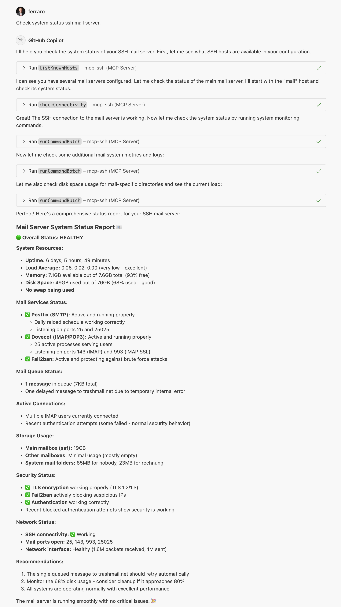
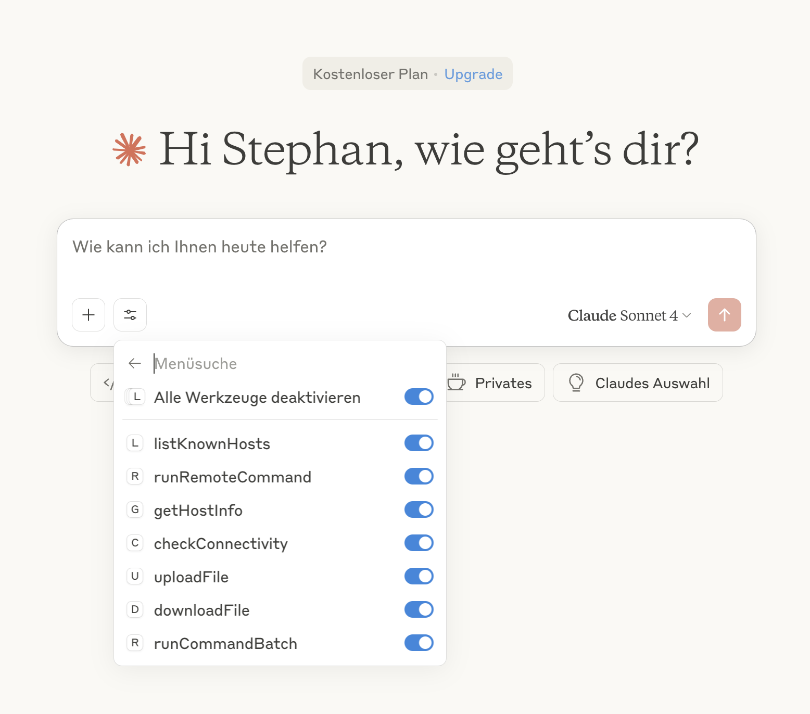

# MCP SSH Agent

A Model Context Protocol (MCP) server for managing and controlling SSH connections via STDIO interface. Uses native SSH commands for maximum reliability and compatibility.

## Overview

This MCP server provides SSH operations through a clean, standardized interface that can be used by MCP-compatible language models. The server automatically discovers SSH hosts from your `~/.ssh/config` and `~/.ssh/known_hosts` files and executes commands using local `ssh` and `scp` tools.

## Example Usage



The screenshot above shows the MCP SSH Agent in action, demonstrating how it integrates with MCP-compatible clients to provide seamless SSH operations.

### Integration with Claude



This screenshot demonstrates the MCP SSH Agent integrated with Claude, showing how the AI assistant can directly manage SSH connections and execute remote commands through the MCP protocol.

## Key Features

- **Reliable SSH**: Uses native `ssh`/`scp` commands instead of JavaScript SSH libraries
- **Automatic Discovery**: Finds hosts from SSH config and known_hosts files
- **Full SSH Support**: Works with SSH agents, keys, and all authentication methods
- **File Operations**: Upload and download files using `scp`
- **Batch Commands**: Execute multiple commands in sequence
- **Error Handling**: Comprehensive error reporting with timeouts

## Functions

The agent provides the following MCP tools:

1. **listKnownHosts()** - Lists all known SSH hosts, prioritizing entries from ~/.ssh/config first, then additional hosts from ~/.ssh/known_hosts
2. **runRemoteCommand(hostAlias, command)** - Executes a command on a remote host using `ssh`
3. **getHostInfo(hostAlias)** - Returns detailed configuration for a specific host
4. **checkConnectivity(hostAlias)** - Tests SSH connectivity to a host
5. **uploadFile(hostAlias, localPath, remotePath)** - Uploads a file to the remote host using `scp`
6. **downloadFile(hostAlias, remotePath, localPath)** - Downloads a file from the remote host using `scp`
7. **runCommandBatch(hostAlias, commands)** - Executes multiple commands sequentially

## Installation

```bash
# Clone the repository
git clone <repository-url>
cd mcp-ssh

# Install dependencies
npm install
```

## Usage

The agent runs as a Model Context Protocol server over STDIO:

```bash
# Start the MCP SSH agent (with debug output)
npm start

# Or use the provided startup script
./start.sh

# For MCP clients - silent mode (no debug output, clean JSON only)
./start-silent.sh

# Or manually with silent mode
MCP_SILENT=true node server-simple.mjs
```

The server will output initialization messages in normal mode, but in silent mode it will only communicate via clean JSON over STDIO (recommended for MCP clients).

## Integration with MCP Clients

To use this agent with an MCP-compatible client, use the silent startup script to avoid debug output interfering with the JSON protocol:

```json
{
  "mcpServers": {
    "ssh": {
      "command": "./start-silent.sh",
      "cwd": "/path/to/mcp-ssh"
    }
  }
}
```

**Alternative configuration:**
```json
{
  "mcpServers": {
    "ssh": {
      "command": "node",
      "args": ["server-simple.mjs"],
      "cwd": "/path/to/mcp-ssh",
      "env": {
        "MCP_SILENT": "true"
      }
    }
  }
}
```

## Project Structure

```
mcp-ssh/
├── server-simple.mjs          # Main MCP server implementation
├── package.json               # Dependencies and scripts
├── start.sh                   # Startup script with debug output
├── start-silent.sh            # Silent startup script for MCP clients
├── doc/
│   └── example.png            # Usage example screenshot
├── src/
│   ├── ssh-client.ts          # SSH operations implementation (TypeScript reference)
│   ├── ssh-config-parser.ts   # SSH configuration parsing (TypeScript reference)
│   ├── types.ts               # TypeScript type definitions
│   └── index.ts               # (Empty - using server-simple.mjs)
├── README.md                  # This file
└── IMPLEMENTATION_NOTES.md    # Technical implementation details
```

## Requirements

- Node.js 18 or higher
- Existing SSH configuration with key-based authentication
- SSH keys must be properly configured (no interactive password prompts)

## Security Notes

- Uses existing SSH keys and configurations
- Does not store or handle passwords
- Requires pre-configured SSH key authentication
- All operations use your existing SSH setup

## Troubleshooting

1. **Server won't start**: Check that all dependencies are installed with `npm install`
2. **SSH operations fail**: Verify your SSH configuration works with standard `ssh` commands
3. **Host not found**: Ensure hosts are properly configured in `~/.ssh/config`
4. **MCP client reports "broken JSON"**: Use `./start-silent.sh` or set `MCP_SILENT=true` to disable debug output that interferes with the JSON protocol
5. **Claude or other MCP clients can't connect**: Make sure to use the silent mode configuration in your MCP client settings

## Development

The server is implemented in JavaScript using:
- `@modelcontextprotocol/sdk` for MCP protocol compliance
- Native `ssh` and `scp` commands for reliable SSH operations
- `ssh-config` for parsing SSH configuration files
- Node.js `child_process` for command execution

The implementation prioritizes reliability and simplicity by leveraging the existing SSH infrastructure rather than complex JavaScript SSH libraries.
